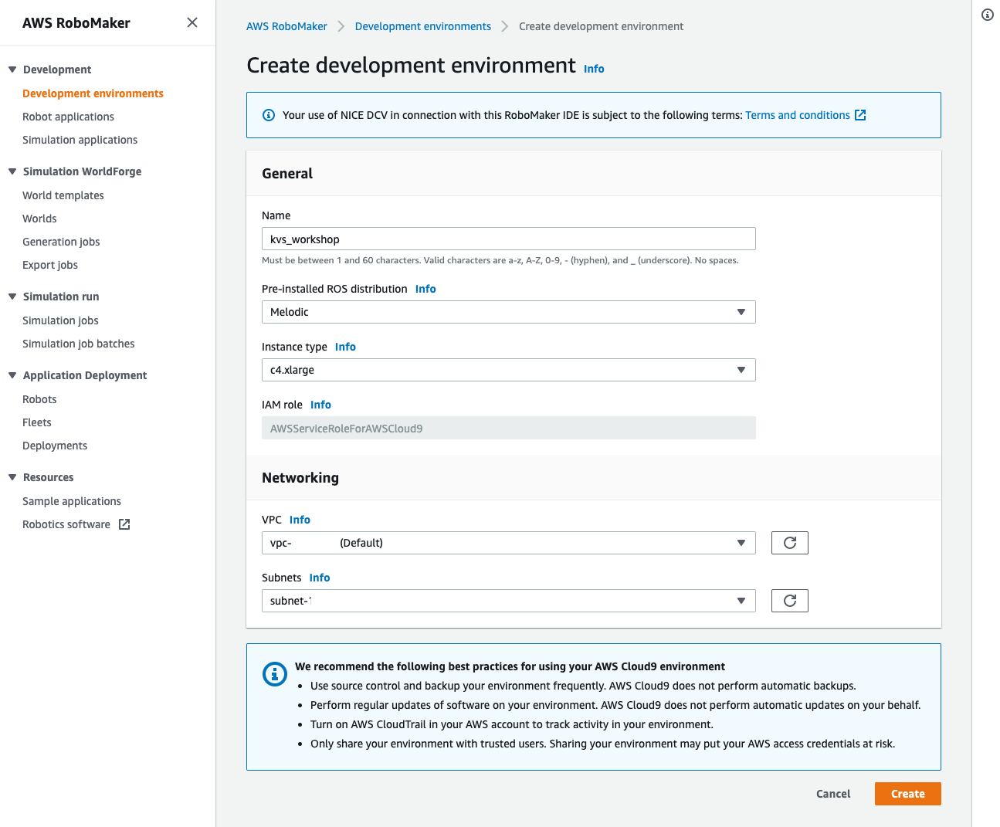

## Objective:

This workshop showcases video solutions for robotics using [Amazon Kinesis Video Streams](https://docs.aws.amazon.com/kinesisvideostreams/latest/dg/what-is-kinesis-video.html), and [Amazon Kinesis Video Streams with WebRTC](https://docs.aws.amazon.com/kinesisvideostreams-webrtc-dg/latest/devguide/what-is-kvswebrtc.html). The image/video data from the robot is setup using a [simulation application](https://github.com/aws-samples/multi-robot-fleet-sample-application) in **Gazebo/ROS**. We convert the Image ROS-topic to and RTSP stream using the [ROS-RTSP ROS-package](https://github.com/CircusMonkey/ros_rtsp)

**NOTE:**
- You can skip the simulation setup if you already have an IP Camera with an RTSP URL
- This demo uses Gstreamer based examples, primarily for ease of use. Please evaulate official SDK's and [documentation](https://docs.aws.amazon.com/kinesis/index.html) for production use case


## Setup
Have an Ubuntu 18.04 machine with ROS Melodic installed and AWS credential setup as env variables on the local machine. Specifically
* AWS_REGION
* AWS_ACCESS_KEY_ID
* AWS_SECRET_ACCESS_KEY
* AWS_SESSION_TOKEN (optional)

For this workshop, we recommend using the AWS RoboMaker development environment, for which these instructions have been tested against

### AWS RoboMaker development environment setup

1. Setup a Melodic Ubuntu 18.04 instance by selecting the corresponding AWS RoboMaker development environment as shown in image below



2. Create a role with 'AmazonKinesisVideoStremsFullAccess' managed policy as shown in the image below. Name the role as `ec2_kinesis_video_role`


**NOTE: This policy gives access to all kinesis API's. In production, you should [create custom policy](https://docs.aws.amazon.com/IAM/latest/UserGuide/access_policies.html) specific to your requirements** 

3. Attach it to your EC2 instance following the instructions [here](https://aws.amazon.com/blogs/security/easily-replace-or-attach-an-iam-role-to-an-existing-ec2-instance-by-using-the-ec2-console/) , as shown below


## Application setup

Clone this [repository](https://github.com/aws-samples/robot-camera-streaming-demo-with-aws-kvswebrtc-kvs/) onto the development environment, preferably under "/home/ubuntu/environment location"


```
cd /home/ubuntu/environment
git clone https://github.com/aws-samples/robot-camera-streaming-demo-with-aws-kvswebrtc-kvs.git
```

Run the following command to install corresponding [libararies, software](setup_with_sudo.bash) and the [robot and kvs applications](user_scripts/setup_as_user.bash)

```
cd robot-camera-streaming-demo-with-aws-kvswebrtc-kvs/user_scripts
sudo bash setup_with_sudo.bash; bash setup_as_user.bash
```

Once the above command is completed, change the sample application code present in the sample application source code present in your environment. You can open the file with the following commands if you used the default setup
```
cd /home/ubuntu/environment/amazon-kinesis-video-streams-webrtc-sdk-c/samples/
vim kvsWebRTCClientMasterGstreamerSample.c
```

The code is change is shown in before and after pictures below


You can find the file with the code to copy [here](user_scripts/rtsp_command.txt) , with the end code as 
```
                pipeline = gst_parse_launch(
                        "rtspsrc location=rtsp://0.0.0.0:8554/back short-header=TRUE ! rtph264depay ! "
                        "video/x-h264,stream-format=byte-stream,alignment=au,profile=baseline ! "
                        "appsink sync=TRUE emit-signals=TRUE name=appsink-video",
                        &error);
```

## Launch Applications

### Launch ROS Application
Click `Launch Desktop` button on cloud9 to access the GUI on the browser. Access the terminal via `Activities -> terminator`
Once you have a terminal setup, run the ros appication by running the following command
```
export START_X=0  # start location of robot
export START_Y=0
export START_YAW=0
export HUSKY_REALSENSE_ENABLED=true
export HUSKY_LMS1XX_ENABLED=true
roslaunch robot_fleet husky_app_with_rtsp.launch
```

This should setup a ros and gazebo setup like the following 

### Launch Webrtc application
While the ROS application is running, open another new terminal set the credentials on the env variables using
```
creds_from_role_attached ec2_kinesis_video_role  #Or name you have provided to the ec2 role
```

Once the credentials are setup, you can setup the webrtc application by running the following commands *IN THE SAME TERMINAL WHERE YOU SETUP CREDENTIALS*
```
# build code again since we modified it with new gst-pipeline

echo "building webrtc code"
APP_DIRECTORY=/home/ubuntu/environment
mkdir $APP_DIRECTORY/amazon-kinesis-video-streams-webrtc-sdk-c/build
cd $APP_DIRECTORY/amazon-kinesis-video-streams-webrtc-sdk-c/build
cmake ..
make

# Set environment variable for log level
export AWS_KVS_LOG_LEVEL=3

# move to location of built code
echo "launching webrtc app"
cd $APP_DIRECTORY/amazon-kinesis-video-streams-webrtc-sdk-c/build/samples

# Create signalling channel
echo "create signalling channel, in case it doesnt exist"
aws kinesisvideo create-signaling-channel --channel-name robot_webrtc_stream
sleep 3

# Launch the application
./kvsWebrtcClientMasterGstSample robot_webrtc_stream
```

This will create a KVS webrtc connection between the robot and your browser. You can view it on the Console page by selecting the corresponding signaling channel as following. 

### Launch KVS video stream application

Setup the credentials in the new terminal using the command
```
creds_from_role_attached ec2_kinesis_video_role  #Or name you have provided to the ec2 role
```

Setup the KVS stream from the same terminal from which you have the credentials using the following commands
```
# set env vars to recognize the kvs plugin
APP_DIRECTORY=/home/ubuntu/environment
export GST_PLUGIN_PATH=$GST_PLUGIN_PATH:$APP_DIRECTORY/amazon-kinesis-video-streams-producer-sdk-cpp/build
export LD_LIBRARY_PATH=$LD_LIBRARY_PATH:$APP_DIRECTORY/amazon-kinesis-video-streams-producer-sdk-cpp/open-source/local/lib

export AWS_KVS_LOG_LEVEL=3

# Make create stream api everytime for simplicity. It just fails if it already exists.
echo "Creating a new stream if it doesnt exist"
aws kinesisvideo create-stream --stream-name "robot_kvs_stream" --data-retention-in-hours "120"
sleep 3
echo "setting up kvs streaming"
gst-launch-1.0 -v rtspsrc location=rtsp://0.0.0.0:8554/back drop-on-latency=true use-pipeline-clock=true do-retransmission=false latency=0 ! rtph264depay ! h264parse ! kvssink stream-name="robot_kvs_stream" storage-size=512 aws-region=$AWS_REGION
```

You can then view the current and historical data that is streamed from the robot on the AWS console by selecting the corresponding video stream on the kvs page, as show in the image below.


All the commands for launching applications are available from this [file](user_scripts/utility_bash_functions)

## Clean up

You can kill the processes by running `Ctrl + c` on all the tabs. The webrtc process does not die untill the ROS application is killed.

- Delete the cloud9 environment from `AWS RoboMaker -> Development environment -> Delete`
- Delete the webrt signalling channel from `KVS Video Streams -> Signaling Channels -> Delete`
- Delete the KVS video stream from `KVS Video Streams -> Video Streams -> Delete`
- Delete the EC2 role from `IAM -> Roles -> ec2_kinesis_video_role -> Delete Role`


## Security

See [CONTRIBUTING](CONTRIBUTING.md#security-issue-notifications) for more information.

## License

This library is licensed under the MIT-0 License. See the LICENSE file.

